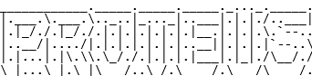

# Proteus


```
                _                 
                | |                
 _ __  _ __ ___ | |_ ___ _   _ ___ 
| '_ \| '__/ _ \| __/ _ \ | | / __|
| |_) | | | (_) | ||  __/ |_| \__ \
| .__/|_|  \___/ \__\___|\__,_|___/
| |                                
|_| 

```



This repo serves as the base for my Flipper Zero/Bad USB based project. I worked with my team to design a 3D-printed case for my Flipper, to make it look like a standard laptop charger. With the use of these scripts and some modifications, we have designed a "bad charger".

Currently, the STL files for the power bank and laptop charger prototypes will be uploaded, as well as images of said prototypes. Any further Updates in terms of designs will be uploaded here. \
This repository also contains a collection of scripts I have written to serve as a supplement for the case, if you choose to print it. 

As always, this is simply a proof of concept. PLease use the scripts and badusb scripts responsibly, and only on systems you have permission to test on. 
